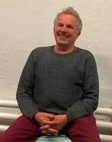

+++
title = "Als Einzelner kann ich nicht viel machen, aber ich kann versuchen einen Beitrag zu leisten."
date = "2025-02-12"
draft = false
pinned = false
image = "christophhebing.jpg"
+++
\
Christoph Hebing ist Gründer und Leiter des Theaterclubs *Theater kennt keine Grenzen*, kurz *TKKG*, für Menschen mit Migrationshintergrund. Mit diesem möchte er zu einer besseren Welt beitragen.\


Evita Brechbühler und Marilène Zumstein

Versteckt in einem Brückenpfeiler liegt ein Theaterraum. Von aussen führen erst viele Treppen neben der Brücke hinunter, bevor man im Inneren wieder hinaufsteigt. Drinnen erwartet uns eine warme, einladende Atmosphäre. Ein gemütlicher Raum mit Küche, Tischen und bequemen Sitzecken. Verbunden durch eine Tür ist nebenan ein grosser Theaterraum. Mitten in diesem kreativen Chaos steht Christoph Hebing, der Leiter des TKKG. Er begrüsst uns mit einem offenen Lächeln. Seine entspannte und lockere Art macht sofort klar: Hier zählt das Miteinander. Vor einer seiner Theaterproben nimmt er sich Zeit, um mit uns über seine Arbeit, seine Vorstellungen und die Bedeutung des Theaters und dem TKKG zu sprechen.

**Was bedeutet Theater für Sie persönlich?**\
Theater ist für mich ein Ort des Ausprobierens und Entdeckens, ohne dass ich danach jemandem Rechenschaft schuldig bin. Es ermöglicht mir, Dinge übers Leben herauszufinden. Zum Beispiel, dass ich jemanden schlagen kann, ohne danach selbst verprügelt zu werden. Es geht darum, Situationen aus dem Leben nachzustellen, um zu erforschen, wie sie funktionieren. Genau das suche ich im Moment im Theater. Früher war es auch mehr die Lust am Spielen, doch es interessierte mich schon immer, wie alles funktioniert und welche Antworten das Theater auf meine Fragen ans Leben hat.

**Wie kam es zur Gründung des TKKG? Haben Sie ein Mangel an Vielfältigkeit in den Theaterclubs gesehen?**\
Tatsächlich arbeiten wir schon viel länger daran, als es das TKKG schon gibt. Die Arbeit mit Menschen mit Fluchthintergrund, die gemeinsam mit Schweizer*innen Theater spielen und an Projekten arbeiten, gibt es schon seit über zwanzig Jahren. Beim ersten Projekt, was in Zusammenarbeit mit einem anderen Theater entstand, waren etwa 25 Teilnehmende aus zehn verschiedenen Sprachräumen dabei. Niemand wusste, wie wir uns verständigen sollten, aber irgendwie hat es funktioniert. Mein Interesse für diese Arbeit wurde grösser und ich erkannte, wie notwendig solche Räume für Menschen mit Migrationshintergrund sind, damit sie die Möglichkeit bekommen, mit der Schweizer Gesellschaft in Kontakt zu kommen.

> *Damals habe ich gesagt, wir machen das Projekt, bis es nicht mehr gebraucht wird, aber es wird immer wichtiger.* (Christoph Hebing)

**Wie hat das TKKG die Integration positiv verändert?**\
Im TKKG arbeiten wir alle auf Augenhöhe an einem gemeinsamen Projekt. Wir beginnen immer bei null. Sie wissen nicht, wer ich bin, und ich weiss nicht, wer sie sind. Wir lernen uns kennen mit dem Ziel, etwas gemeinsam auf die Bühne zu stellen. Durch meine Erfahrung im Theater, ist meine Aufgabe, eine Art Katalysator zu sein. Ich schlage Übungen vor, die Prozesse in Gang bringen. Wir beginnen gemeinsame Erfahrungen zu machen und Vertrauen aufzubauen. Dadurch wachsen wir zusammen und können mehr Selbstvertrauen gewinnen. In den meisten Fällen profitieren alle davon.

 **Der Theaterraum ist ein *Safe Space*, indem die Personen über ihre Emotionen sprechen können.**\
Ja, genau. Darauf legen wir grossen Wert. Hier wird niemand beurteilt. Jeder soll hier so sein dürfen, wie er oder sie ist. Man darf auch alles erzählen, auch wenn es Unsinn ist. Dann kann man darüber sprechen oder spielen. Man soll das Recht haben, einfach mal so zu sein, wie man ist. Es dürfen hier nicht nur die guten Seiten, sondern auch mal die Schlechten Platz finden. Das bedeutet aber, dass wir Wege finden müssen, wie wir trotz Unterschieden miteinander funktionieren können. Genau das können wir in diesem kleinen Raum üben.

**Bringen die Personen ihre Erfahrungen und Geschichten jeweils auch auf die Bühne?**\
Wir versuchen nicht die einzelnen Geschichten der Menschen auf die Bühne zu bringen. Für mich wäre das wie ein Ausstellen ihrer Schicksale. Grundsätzlich möchte ich an Themen arbeiten, die alle betreffen. Natürlich können die Teilnehmenden persönliche Erfahrungen einbringen, das ist sogar erwünscht. Meistens werfen wir ein bestimmtes Thema in den Raum, zu dem alle etwas Persönliches sagen können. Mit den unterschiedlichen Ansichten wird es interessant. Man kann diese gemeinsam aushandeln und entwickelt ein Bewusstsein.

> *Wenn ich etwas machen kann, dann mache ich es auch.* (Christoph Hebing)

**Wie können Sie mit emotionalen schwierigen Situationen umgehen?**\
Ich glaube, man muss eine gewisse Sensibilität entwickeln, um zu spüren, ob sich jemand öffnen kann oder ob die Person sich verschliesst. Wenn jemand sich bedrängt oder überfordert fühlt, versuche ich, dafür geradezustehen. Ich finde es wichtig, Probleme anzusprechen, ohne dass man Angst haben muss, soweit das möglich ist. Manchmal kann man die Angst unter Umständen auch nicht überwinden. Das ist dann meine Aufgabe, das zu spüren. Natürlich haben wir auch schon angespannte Momente erlebt, die fast zu einer Prügelei ausgeartet sind. Bisher konnten wir solche Probleme immer gemeinsam in der Gruppe lösen.

> *Bei Streitereien muss man einfach klar sagen: Stopp, wir sind hier, um gemeinsam zu spielen. Wenn das nicht funktioniert, müssen wir das Projekt abbrechen.* (Christoph Hebing)

**Gibt es ein Projekt, wo Ihnen besonders schwergefallen ist und Sie danach sehr stolz waren?**\
Da gibt es viele! Eines, das mir sofort einfällt, ist das Theaterstück *Loop*. Damals war ich allein, was auch die grösste Herausforderung war. Die Gruppe war super, aber für mich wurde klar, dass ich viel lieber im Team arbeite, um mich auch austauschen zu können. Das Stück selbst ist sehr gut herausgekommen. Es ging darum, dass man im Leben in einem Loop ist, ein Teufelskreis, in dem sich Situationen immer wieder wiederholen. Wir haben Möglichkeiten gesucht, wie man daraus ausbrechen und sein Leben verändern könnte.

**Was möchten Sie mit dem TKKG in Zukunft erreichen?**\
Dass es keinen Krieg mehr gibt und diese Ungerechtigkeiten aufhören. Natürlich kann ich als Einzelner nicht viel machen, aber ich kann versuchen, einen Beitrag zu leisten. Und für mich ist dieser Beitrag das Theater. Es ist ein sehr langer Weg, und das Ziel ist wahrscheinlich nicht erreichbar**.**

\
Der Theaterclub TKKG (Theater kennt keine Grenzen) gehört zu Junge Bühne Bern. Dieser Club wurde speziell für Personen mit Migrationshintergrund eröffnet. Sein Ziel ist, dass sie mehr mit der Schweizer Gesellschaft in Kontakt kommen und unsere Kultur auch besser kennenlernen können. Im Jahr 2002 wurde es von Christoph Hebing und dem Partner-Theater «Schlachthaus» eröffnet. Damals kannte man es noch nicht als TKKG, es war nur ein Gefäss als Experiment. Dank grosser Nachfrage ist daraus der Club TKKG entstanden.\
